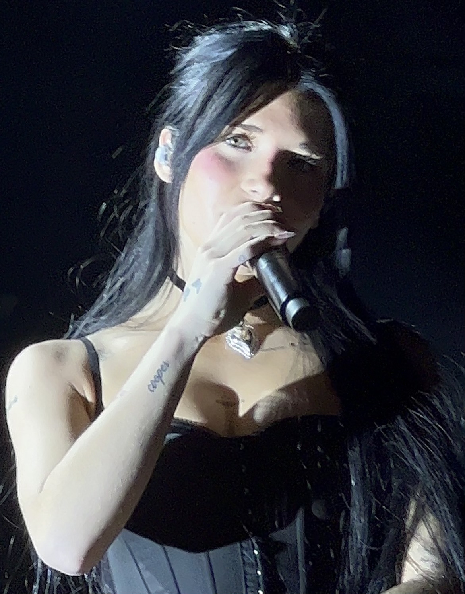
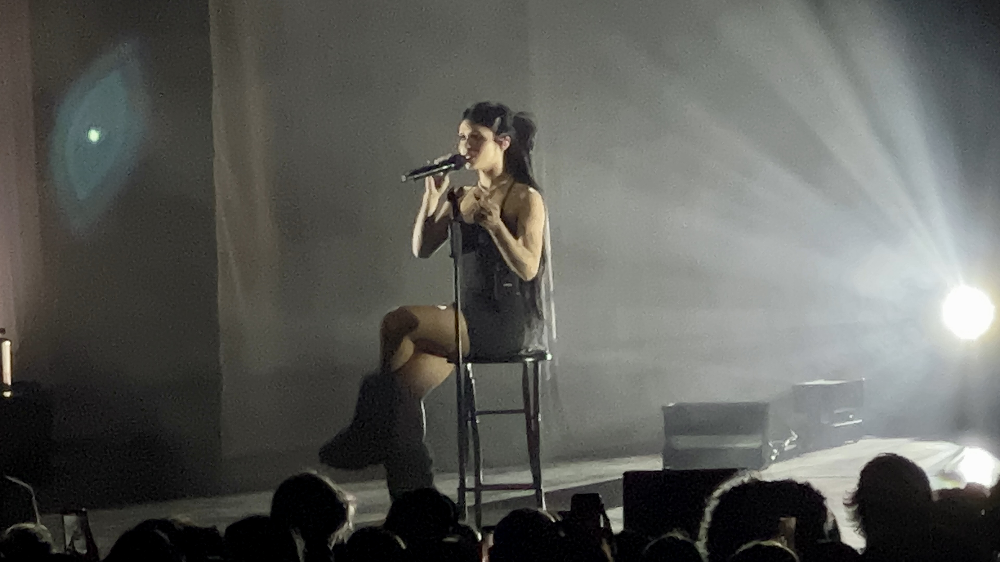
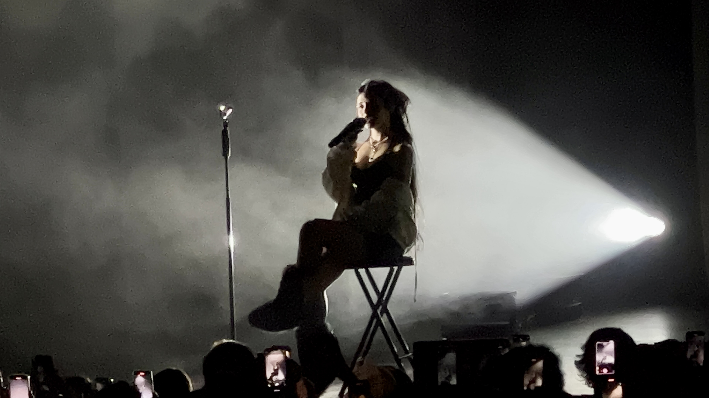

Ana Clara 2E
<section id="Nessa Barrett" class="my-5 pt-6 secao-tropicalia">
        

                

                        <h2>Quem é Nessa Barrett?</h2>
                        
Janesa Jaida "Nessa" Barrett, é uma cantora, compositora e influenciadora digital norte-americana. Ela ganhou destaque no TikTok e começou a enviar covers ainda adolescente, o que a levou a assinar um contrato com a Warner Records. Em 2020, lançou seu single de estreia, "Pain".
                             Em 2021, lançou seu EP de estreia, Pretty Poison, que combinava elementos de pop alternativo e pop-rock. Em seguida, lançou seu álbum de estreia, Young Forever, no ano seguinte. Em 2023, lançou outro EP, Hell Is a Teenage Girl, e em 2024, seu segundo álbum de estúdio, Aftercare, que incorporou electropop e synthpop. 

                

        

</section>
<section id="inicio" class="my-5">
        

                

                        <h1 class="display-4 text-white fst-italic fw-bold">Boas-vindas a</h1>
                        
                        <a href="#tropicalia"
                                class="btn btn-primary btn-lg botao-inicio fw-semibold">Quero conhecer!</a>
                

                
            

</section>
<section id="tropicalia" class="my-5 pt-6 secao-tropicalia">
        

                

                        
                

                

                        <h2>Como começou sua carreira?</h2>
                        
Em 2019, Barrett começou a postar vídeos no TikTok, o que a levou a assinar um contrato de gravação com a Warner Records. Em julho de 2020, ela lançou seu single de estreia, a balada "Pain", baseada em piano.[6]

 Em outubro de 2020, ela lançou seu segundo single, "If U Love Me".[7] Em dezembro de 2020, Barrett lançou uma interpretação sombria de "Santa Baby". Em fevereiro de 2021, Barrett lançou a faixa "La Di Die", que explora as desvantagens da fama com Jxdn (en), produzida por Travis Barker.[8][9][10] Barrett e Jxdn, junto com Barker, apresentaram o single ao vivo pela primeira vez no episódio de 7 de abril de 2021 do Jimmy Kimmel Live! e performaram a música novamente no The Ellen DeGeneres Show em 12 de abril de 2021.

   

</section>

